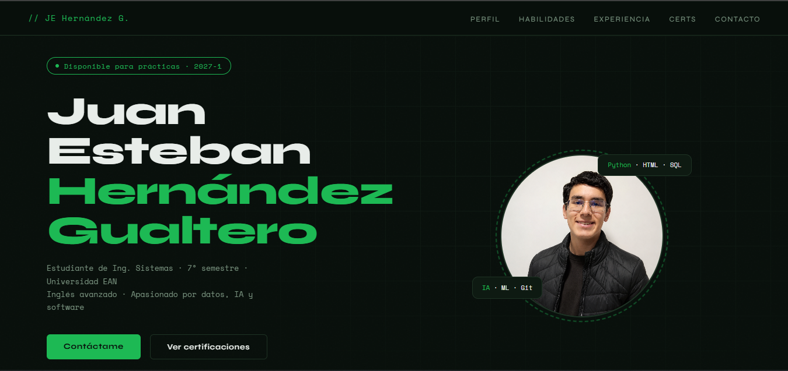

# 🌐 Portafolio Personal

Repositorio del código fuente de mi portafolio web, desarrollado para presentar mi perfil profesional, proyectos, experiencia y tecnologías con las que trabajo.

## 🚀 Ver sitio web

👉 **https://juanexzedh.github.io/Portfolio/**

---

## 📌 ¿Qué encontrarás?

- 👨‍💻 Perfil profesional
- 🚀 Proyectos destacados
- 🛠️ Tecnologías
- 🎓 Formación y certificaciones
- 📫 Información de contacto

---

## 🛠️ Tecnologías utilizadas

- HTML5
- CSS3
- JavaScript

---

## 📷 Vista previa

> *(Aquí puedes colocar una captura de pantalla del portafolio.)*

```md

```

---

## 📬 Contacto

- GitHub: https://github.com/juanexzedh
- LinkedIn: *(cuando lo tengas)*
- Correo: *juanexzedh@gmail.com*